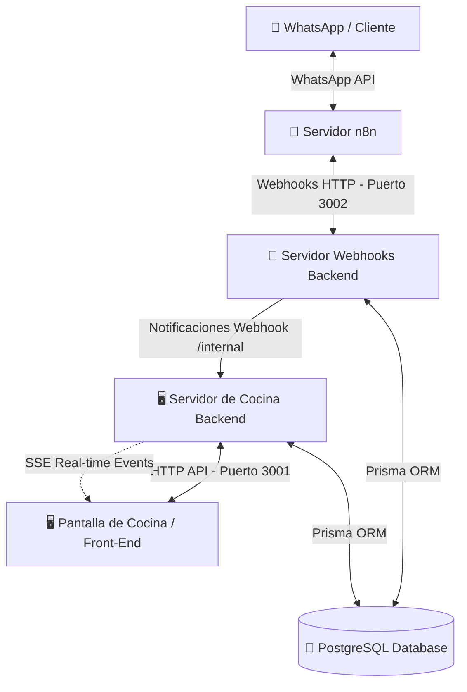

# Especificación de Comunicación Back-End (Guía MCP del Servidor)

Este documento sirve como especificación y mapa de contexto (Model Context Protocol / Context Guide) para que los agentes de IA, desarrolladores o integradores comprendan y operen sobre el back-end del sistema de bot conversacional y pantalla de cocina del restaurante **Santo Bocado**.

---

## 1. Arquitectura de Servidores y Puertos

El back-end está compuesto por **dos servidores Express independientes** que corren sobre la misma base de datos relacional PostgreSQL (vía Prisma ORM), dividiendo las responsabilidades operativas para acústica de escalabilidad y aislamiento:



### 🖥️ Servidor de Cocina (Kitchen/Main Server)
* **Puerto por defecto:** `3001`
* **URL Base:** `http://localhost:3001/api`
* **Responsabilidad:** Soportar la pantalla de cocina (pedidos activos), el menú completo, la disponibilidad de los productos y la visualización de reservas.
* **Sincronización:** Emite eventos en tiempo real a través de **Server-Sent Events (SSE)**.

### 🤖 Servidor de Webhooks N8N (N8N Backend Server)
* **Puerto por defecto:** `3002`
* **URL Base:** `http://localhost:3002/api/webhooks`
* **Responsabilidad:** Proporcionar endpoints específicos consumidos por los flujos automatizados de n8n (orquestados por la API de WhatsApp Business y un agente de IA). Facilita búsquedas de clientes, registro de historial de mensajes, reservas y carga de pedidos conversacionales.

---

## 2. Modelos de Datos Relevantes (Esquema Prisma/PostgreSQL)

Los modelos principales que se consultan y manipulan en el sistema son:

### 📋 Pedido (`pedido`)
Representa una orden realizada por un cliente en el sistema.
* **id:** `UUID` (Identificador único en formato string)
* **restaurante_id:** `UUID` (ID del restaurante asociado)
* **cliente_id:** `UUID` (Cliente que realiza la compra)
* **conversacion_id:** `UUID` (ID de la conversación activa asociada)
* **direccion_id:** `UUID | null` (ID de la dirección si el tipo es 'delivery')
* **numero_pedido:** `Int` (Correlativo diario autoincremental por restaurante que inicia a las 06:00:00 UTC)
* **estado:** `'pendiente' | 'confirmado' | 'en_preparacion' | 'entregado' | 'cancelado'`
* **tipo:** `'delivery' | 'recoger'`
* **metodo_pago:** `'efectivo' | 'transferencia' | 'tarjeta'`
* **subtotal:** `Decimal` (Suma de precios de productos)
* **costo_envio:** `Decimal` (Costo por envío, ej. $25.00 en Uman para delivery, $0.00 para recoger)
* **total:** `Decimal` (Subtotal + costo_envio)
* **created_at:** `DateTime`
* **updated_at:** `DateTime`

#### Detalle de Pedido (`pedido_detalle` / `pedido_detalle_modificador`)
* Cada pedido tiene uno o más **detalles** de productos con `cantidad`, `precio_unitario` y `subtotal`.
* Admite notas opcionales (`notas` ej: *"Sin cebolla"*).
* Admite **modificadores** (`pedido_detalle_modificador` ej: *["Extra Queso", "Extra Tocino"]*) con un precio cobrado histórico.

### 🍔 Producto (`producto` / `categoria`)
* **id:** `UUID`
* **nombre:** `String`
* **descripcion:** `String | null`
* **precio:** `Decimal`
* **activo:** `Boolean` (Determina si se ofrece en el menú y si el bot de WhatsApp lo sugiere).
* **categoria_id:** `UUID` (Asociación jerárquica para clasificación en carta).

### 📅 Reserva (`reserva`)
* **id:** `UUID`
* **restaurante_id:** `UUID`
* **cliente_id:** `UUID`
* **mesa_id:** `UUID | null` (Asignación física de mesa en restaurante)
* **fecha:** `Date` (Formato: `YYYY-MM-DD`)
* **hora:** `Time` (Formato: `HH:MM:SS`)
* **num_personas:** `Int`
* **estado:** `String` (`pendiente` | `confirmada` | `cancelada` | `completada`)
* **notas:** `String | null`

### 👤 Cliente (`cliente` / `direccion`)
* **id:** `UUID`
* **nombre:** `String`
* **apellidos:** `String` (Opcional o cadena vacía)
* **telefono:** `String` (Número telefónico de contacto/WhatsApp)
* **direcciones:** Relación de una a muchas direcciones con coordenadas geográficas (`latitude`, `longitude`), `direccion` de texto y `referencias`.

---

## 3. Especificación de Endpoints (API Reference)

### I. Servidor de Cocina (Puerto 3001)

#### 1. Obtener pedidos del día
* **Método:** `GET`
* **Ruta:** `/api/pedidos`
* **Filtro:** Retorna los pedidos creados en el día en curso.
* **Respuesta exitosa (200 OK):**
```json
{
  "ok": true,
  "data": [
    {
      "id": "c9985641-566b-4372-b3d3-9ae801d3a738",
      "estado": "pendiente",
      "tipo": "delivery",
      "numero_pedido": 105,
      "subtotal": "129.00",
      "total": "139.00",
      "metodo_pago": "efectivo",
      "created_at": "2026-07-16T18:45:00.000Z",
      "cliente_telefono": "9994940808",
      "cliente_nombre": "Isaac",
      "productos": [
        {
          "producto_id": "d0000000-0000-0000-0000-000000000007",
          "nombre": "Hamburguesa Crispy",
          "cantidad": 1,
          "notas": "Sin aderezo",
          "precio_unitario": "129.00",
          "subtotal": "129.00",
          "extras": []
        }
      ]
    }
  ]
}
```

#### 2. Obtener un pedido específico
* **Método:** `GET`
* **Ruta:** `/api/pedidos/:id`

#### 3. Actualizar estado de un pedido (Flujo de Cocina)
* **Método:** `PATCH`
* **Ruta:** `/api/pedidos/:id`
* **Cuerpo (JSON):**
```json
{
  "estado": "en_preparacion"
}
```
* **Efecto colateral:** Actualiza la base de datos y difunde el evento SSE `pedido_actualizado`.

#### 4. Crear pedido de prueba para la UI
* **Método:** `POST`
* **Ruta:** `/api/pedidos/test-create`
* **Uso:** Registra un pedido simulado para validar animaciones y SSE en cocina.

#### 5. Eliminar un pedido
* **Método:** `DELETE`
* **Ruta:** `/api/pedidos/:id`
* **Efecto colateral:** Emite el evento SSE `pedido_eliminado`.

#### 6. Conectarse al flujo en tiempo real (SSE)
* **Método:** `GET`
* **Ruta:** `/api/pedidos/stream`
* **Cabecera:** `Accept: text/event-stream`
* **Detalles:** Canal persistente que emite eventos `nuevo_pedido`, `pedido_actualizado`, `pedido_eliminado`.

#### 7. Obtener menú ordenado por categorías
* **Método:** `GET`
* **Ruta:** `/api/menu/:restauranteId`

#### 8. Obtener productos agotados
* **Método:** `GET`
* **Ruta:** `/api/productos/no-disponibles/:restauranteId`

#### 9. Modificar disponibilidad de un producto
* **Método:** `PATCH`
* **Ruta:** `/api/productos/:id/disponibilidad`
* **⚠️ Advertencia de Lógica:** Este endpoint actúa como **conmutador lógico ("toggle")**. Alterna el valor de `activo` en la BD (ignora el booleano explícito que se envíe en el JSON body).

#### 10. Buscar producto por nombre
* **Método:** `GET`
* **Ruta:** `/api/productos/buscar/:restauranteId?q=NombreDelProducto`

#### 11. Notificación interna de webhook (n8n a Cocina)
* **Método:** `POST`
* **Ruta:** `/api/internal/webhook-notify`
* **Cuerpo (JSON):**
```json
{
  "tipo": "NUEVO_PEDIDO" | "PEDIDO_CANCELADO",
  "pedido_id": "uuid-del-pedido"
}
```
* **Efecto colateral:** Si el tipo es `NUEVO_PEDIDO`, consulta los datos del pedido y emite el evento SSE `nuevo_pedido`.

#### 12. Listar reservas con filtros (Panel Admin)
* **Método:** `GET`
* **Ruta:** `/api/reservas`
* **Query Params:** `fecha` (YYYY-MM-DD), `restaurante_id` (UUID), `estado` (pendiente, confirmada, cancelada), `limit`, `offset`.

---

### II. Servidor de Webhooks N8N (Puerto 3002)

#### 1. Registrar pedido desde Bot
* **Método:** `POST`
* **Ruta:** `/api/webhooks/pedidos`
* **Cuerpo (JSON):**
```json
{
  "restaurante_id": "uuid-restaurante",
  "telefono_cliente": "9991234567",
  "nombre_cliente": "Nombre",
  "apellidos_cliente": "Apellidos",
  "datos": {
    "tipo": "delivery" | "recoger",
    "metodo_pago": "efectivo" | "transferencia" | "tarjeta",
    "direccion_texto": "Dirección opcional",
    "referencias": "Referencias opcionales",
    "productos": [
      {
        "nombre": "Nombre de Producto exacto",
        "cantidad": 2,
        "notas": "NA o especificación"
      }
    ]
  }
}
```
* **Comportamiento especial:** Si es *delivery* y no se provee `direccion_texto`, busca direcciones previas:
  * Si hay direcciones previas, lanza un error con código `CONFIRMAR_DIRECCION` devolviendo la dirección más usada para confirmación.
  * Si no hay direcciones, lanza error `DIRECCION_FALTANTE`.
* **Notificación:** Emite automáticamente una petición POST a `/api/internal/webhook-notify` en el puerto 3001.

#### 2. Modificar pedido activo por Bot
* **Método:** `PATCH`
* **Ruta:** `/api/webhooks/pedidos/:id`
* **Regla:** Solo permitido si el estado actual en BD es `'pendiente'` o `'confirmado'`. Permite actualizar tipo, método de pago y reemplazar la lista de productos (calculando de nuevo el total).

#### 3. Cancelar pedido activo por Bot
* **Método:** `PATCH`
* **Ruta:** `/api/webhooks/pedidos/:id/cancelar`
* **Cuerpo (JSON):** `{ "motivo": "Motivo opcional" }`
* **Efecto:** Cambia el estado a `'cancelado'` y notifica internamente al puerto 3001.

#### 4. Buscar o crear cliente conversacional
* **Método:** `POST`
* **Ruta:** `/api/webhooks/clientes/find-or-create`
* **Cuerpo (JSON):** `{ "restaurante_id": "uuid", "telefono": "9991234567", "nombre": "...", "apellidos": "..." }`

#### 5. Obtener cliente por teléfono
* **Método:** `GET`
* **Ruta:** `/api/webhooks/clientes/:restauranteId/telefono/:telefono`

#### 6. Obtener direcciones del cliente
* **Método:** `GET`
* **Ruta:** `/api/webhooks/clientes/:clienteId/direcciones`
* **Estructura devuelta:** Listado de direcciones y el objeto `direccionMasUsada` basado en pedidos previos.

#### 7. Registrar nueva dirección del cliente
* **Método:** `POST`
* **Ruta:** `/api/webhooks/clientes/:clienteId/direcciones`

#### 8. Establecer dirección predeterminada
* **Método:** `PATCH`
* **Ruta:** `/api/webhooks/clientes/:clienteId/direcciones/:dirId/predeterminada`

#### 9. Obtener contexto unificado para IA (Llamada todo-en-uno)
* **Método:** `GET`
* **Ruta:** `/api/webhooks/contexto/:restauranteId/:telefono`
* **Retorna:**
```json
{
  "ok": true,
  "contexto": {
    "cliente_nombre": "Isaac Perez",
    "cliente_telefono": "9994940808",
    "cliente_id": "uuid-cliente",
    "restaurante_id": "uuid-restaurante",
    "conversacion_id": "uuid-conversacion",
    "productos_no_disponibles": ["Boneless"],
    "reserva_activa": null,
    "direcciones_guardadas": [
      {
        "id": "uuid-dir",
        "direccion": "Calle 20 x 15 y 17",
        "referencias": "Casa amarilla",
        "alias": "Casa",
        "predeterminada": true
      }
    ],
    "direccion_sugerida": "Calle 20 x 15 y 17",
    "dia_semana": "sábado",
    "hora_actual": "14:58",
    "historial": []
  }
}
```

#### 10. Gestionar conversaciones y mensajería
* **GET** `/api/webhooks/conversaciones/:restId/:clienteId/historial`: Recupera el historial.
* **POST** `/api/webhooks/conversaciones/mensajes`: Registra un mensaje enviado por el cliente o el bot en el historial.
* **PATCH** `/api/webhooks/conversaciones/:id/cerrar`: Cierra la conversación activa para reiniciar el historial en el siguiente contacto.
* **GET** `/api/webhooks/conversaciones/:id/mensajes/buscar?q=...`: Busca términos de chat.

#### 11. Reservar mesa por Bot
* **Método:** `POST`
* **Ruta:** `/api/webhooks/reservas`
* **Cuerpo (JSON):** `{ "restaurante_id": "...", "cliente_id": "...", "fecha": "YYYY-MM-DD", "hora": "HH:MM:SS", "num_personas": 4, "notas": "..." }`

#### 12. Modificar reserva activa
* **Método:** `PATCH`
* **Ruta:** `/api/webhooks/reservas/:id`
* **⚠️ Regla de Negocio:** Para poder modificar una reserva (fecha, hora, personas), el cliente debe solicitarlo con **al menos 5 horas de anticipación** a la hora reservada. De lo contrario, se deniega la petición con error 400.

#### 13. Obtener última reserva del cliente
* **Método:** `GET`
* **Ruta:** `/api/webhooks/reservas/buscar/ultima`

---

## 4. Flujo en Tiempo Real (Server-Sent Events)

El endpoint `GET /api/pedidos/stream` (puerto 3001) mantiene a los clientes conectados recibiendo eventos persistentes en formato texto.

### Estructura de Eventos:

| Evento | Payload (`data`) | Disparador |
| :--- | :--- | :--- |
| `nuevo_pedido` | Objeto `Pedido` completo con detalles, cliente y dirección. | Cuando n8n o un test crea un pedido y notifica al puerto 3001. |
| `pedido_actualizado` | Objeto `Pedido` con las propiedades modificadas. | Al actualizar estado del pedido en cocina (`PATCH /api/pedidos/:id`). |
| `pedido_eliminado` | `id` (UUID en formato string) del pedido eliminado. | Al eliminar físicamente un pedido (`DELETE /api/pedidos/:id`). |

---

## 5. Directrices de Desarrollo y Control de Errores

1. **Estructura de respuesta HTTP estándar:**
   * Éxito: `{ ok: true, data/pedido/reservas: ... }`
   * Error: `{ ok: false, error: 'CODIGO_ERROR', message: 'Mensaje descriptivo' }`
2. **Ciclo de Estados de Pedido:**
   * La secuencia recomendada es `pendiente` ➡️ `confirmado` (si aplica) ➡️ `en_preparacion` ➡️ `entregado`. Un pedido cancelado rompe esta secuencia y finaliza de inmediato.
3. **Manejo de Zonas Horarias e ISO Parsing:**
   * Las fechas de reservaciones enviadas por n8n (`fecha + 'T' + hora`) se interpretan explícitamente en el huso de referencia UTC de base de datos añadiendo la bandera `'Z'`. Esto neutraliza la diferencia horaria de los servidores Docker respecto a la hora local de Mérida (UTC-6) y previene falsos positivos en la validación de fechas pasadas.
